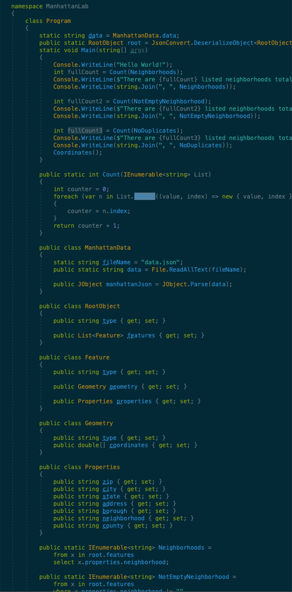

# lab-401-09

# Challenge Summary
In this lab we had to
1. Create properies and methods to pull in and sort through data from a json file

## Approach & Efficiency
added a geo json file and brough in information and used IEnurmeral to go through file to find number of properties

## Solution

